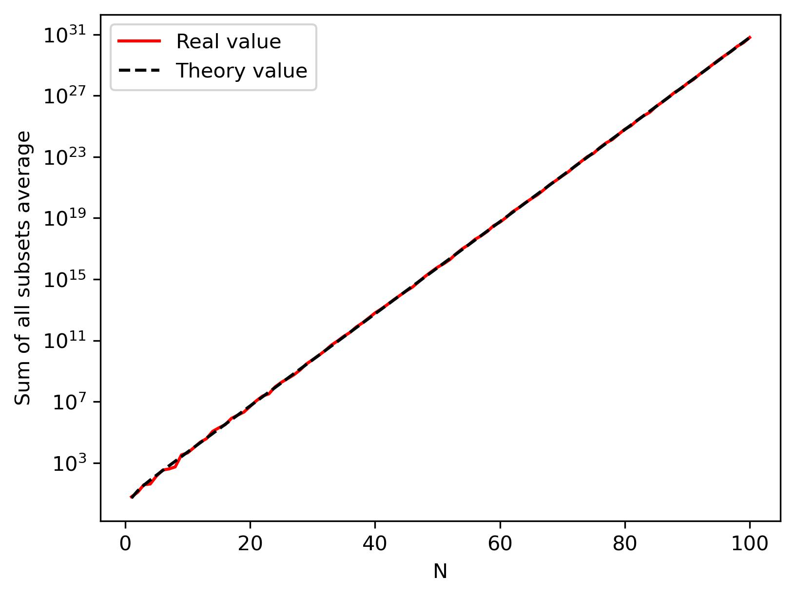

# Assignment 01

## 1. Flowchart

参照流程图要求对 a、b、c 进行判断如下：

```python
def Print_value(a, b, c) -> list:
    """
    完全遵照流程图进行大小判断
    """
    if a > b:
        if b > c:
            result = [a, b, c] # a > b > c
        else:
            if a > c:
                result = [a, c, b] # a > c > b
            else:
                result = [c, a, b] # c > a > b
    else:
        if b > c:
            return
            # if a > c:
            #     result = [b, a, c] # b > a > c
            # else:
            #     result = [b, c, a] # b > c > a
        else:
            result = [c, b, a] # c > b > a
    return result
```

`Print_value(a=5, b=15, c=10)` 的结果为 `None`。

<div style="page-break-after:always"></div>

## 2. Continuous celing function

题目要求编写一个调用自身（递归）的函数，因此设定好递归返回条件（$F(1)=1$ ）防止无限计算下去即可。

```python
from math import ceil
from random import random

def F(x: float) -> float:
    """
    递归计算，使用条件表达式简化书写
    """
    result = F(ceil(x/3)) + 2*x if x != 1 else 1
    return result
```

计算结果案例：

```python
>>> random_list = [random()*10 for x in range(5)]
>>> print(random_list)
[2.627896070509459, 3.8041415697813905, 5.076011927801577, 1.2374907762253684, 6.604136045992739]
>>> result_list = [F(x) for x in random_list]
>>> print(result_list)
[6.255792141018918, 12.608283139562781, 15.152023855603154, 3.474981552450737, 20.208272091985478]
```

<div style="page-break-after:always"></div>

## 3. Dice rolling

### 3.1

对于计算 10 个骰子获得总点数 x 的途径总数。可以考虑直接计算所有组合，不过计算量会比较大。因此这里通过递归的方式将目标分解，设计函数：将目标骰子总面值 x 和剩余骰子数 n 作为参数，计算单个骰子取 1\~6 时剩余 n-1 个骰子总面值为 x-1 ~ x-6 的途径数（通过递归实现），最终在仅有 1 个骰子时终止递归，并不断累加。

```python
def Find_number_of_ways(x: int, n_dice: int = 10) -> int:
    """
    获取在给定骰子个数下，可以得到给定目标骰子面值和的途径数
    # Parameters:
        x       目标骰子面值和
        n_dice  骰子个数
    # Returns:
        n_way   n_dice 个骰子总面值 x 点的途径数
    # Notes:
        这里计算的是排列数而非组合数，也即 (骰子 1 投出 1, 骰子 2 投出 2) 与 (骰子 1 投出 2, 骰子 2 投出 1) 是两种不同的途径
    """
    x_min, x_max = n_dice*1, n_dice*6 # 计算给定骰子可以投出的面值范围
    n_way = 0 # 初始化途径数
    if (x_min <= x <= x_max): # 如果在有效范围内，则继续计算，否则途径数为 0
        if n_dice > 1: # 有一个以上的骰子，递归计算第一个骰子的六种面值下的途径数总和
            for i in range(1, 6+1):
                x_new, n_dice_new = x - i, n_dice - 1
                n_way += Find_number_of_ways(x_new, n_dice_new)
        else:
            n_way = 1 # 只有一个骰子，那就仅有一种途径
    return n_way
```

### 3.2

```python
>>> x_list = list(range(10, 60+1))
>>> Number_of_ways = [Find_number_of_ways(x) for x in x_list]
>>> print(Number_of_ways)
[1, 10, 55, 220, 715, 2002, 4995, 11340, 23760, 46420, 85228, 147940, 243925, 383470, 576565, 831204, 1151370, 1535040, 1972630, 2446300, 2930455, 3393610, 3801535, 4121260, 4325310, 4395456, 4325310, 4121260, 3801535, 3393610, 2930455, 2446300, 1972630, 1535040, 1151370, 831204, 576565, 383470, 243925, 147940, 85228, 46420, 23760, 11340, 4995, 2002, 715, 220, 55, 10, 1]
>>> print(f"x is {x_list[Number_of_ways.index(max(Number_of_ways))]}") # 获取最大值，然后取索引，打印相应位置的 x 值
x is 35
```

在 10 个骰子，设置 x 取 10 到 60 时，可以看到结果非常接近正态分布，根据中心极限定理，随着骰子数目增加，投出的平均值将集中的 3.5 附近，也即在投出该值的可能性最大（途径数最多），对应的总点数即为 3.5×n，在 n 取 10 时，x 取 35。程序计算的结果也支持该结论。

<div style="page-break-after:always"></div>

## 4. Dynamic programming

### 4.1

需要获得长度为 N 大小介于 0 到 10 的整数随机数组。因此使用 random 模块的 random 函数获取从 0 到 11 的浮点数，然后向下取整，重复 N 次获得最终的数组。使用的函数决定当 N 较大时，结果在 0 到 10 之间均匀分布。

```python
from random import random
from math import floor, factorial
from itertools import combinations
import matplotlib.pyplot as plt

def Random_integer(N: int) -> list:
    """
    取长度为 N、数值大小从 0 到 10 的随机数组，使用列表推导式简化书写
    """
    result = [floor(random()*11) for x in range(N)]
    return result
```

### 4.2

需要书写函数计算随机数组的所有子集平均值的和。

一种方式比较简单，使用 itertools 库的 combinations 方法，对数组的所有子集进行迭代，需要计算 $\sum_{i=1}^N \mathbf{C}_N^i=\sum_{i=1}^N\frac{N!}{i!(N-i)!}$ 次，当 N 非常大时则计算量非常庞大。

```python
def Sum_averages_old(array: list) -> float:
    """
    计算数组 array 所有子集的平均和
    
    使用 itertools 库的 combinations 方法，其可以给出给定数组所有给定长度组合的可迭代对象
    """
    n = len(array)
    result = 0
    for i in range(1, n+1): # 所有子集可能长度进行迭代
        for subset in combinations(array, i): # 计算每一个长度 i 的子集的均值，并累加
            result += sum(subset)/i
    return result
```

另一种方式先从数学上对计算过程进行简化。因为计算的是数组的所有子集，因此数组中的每个元素应当是等价的，也即其对最终结果的贡献权重应当是相等的。此时我们计算出该权重再乘以数组和即可得到最终结果。其公式书写如下：

$$
\text{Sum}=\sum_{i=1}^N\left(\frac{1}{i}\times \frac{N!}{i!(N-i)!}\times \frac{i}{N}\right)\sum_{j=1}^N x_j=\sum_{i=1}^N\left[\frac{N!}{i!(N-i)!}\right]\sum_{j=1}^N \frac{x_j}{N}
$$

使用程序实现，阶乘通过 math 库的 factorial 函数计算，然后使用 sum 对列表进行求和即可。

```python
def Sum_averages(array: list) -> float:
    n = len(array)
    result = sum([factorial(n-1)/(factorial(i)*factorial(n-i)) for i in range(1,n+1)])*sum(array)
    return result
```

对于 4.1 定义随机数组的方式，可以得到理论平均值在 5 附近，因此可以得到理论结果为 $\text{Sum}=5\times \sum_{i=1}^N\frac{N!}{i!(N-i)!}$。

### 4.3

```python
N_max = 100
random_list = [Random_integer(N) for N in range(1, N_max+1)]
Total_sum_averages = [Sum_averages(x) for x in random_list]
Total_sum_averages_prodict = [5*sum([factorial(N)/(factorial(M)*factorial(N-M)) for M in range(1, N+1)]) for N in range(1, N_max+1)] # 理论值

fig = plt.figure(figsize=[6, 4.5], dpi=300)
ax = fig.add_subplot()
x = range(1, N_max+1)
ax.plot(x, Total_sum_averages, "r", label="Real value")
ax.plot(x, Total_sum_averages_prodict, "k--", label="Theory value")
ax.set_xlabel("N")
ax.set_ylabel("Sum of all subsets average")
ax.set_yscale("log")
ax.legend()
fig.savefig("images/PS1_4_figure1.jpg", transparent=True, bbox_inches='tight')
```



计算了 N 从 1 到 100 的结果，并将结果绘制出来（这里对 y 轴取了对数），可以看到随着 N 增大，所有子集平均值的和也指数增加。根据集合论的基本定理，n 个元素的集合子集总数为 $2^n$（该定理通过谷歌搜索获得）。由于这里不考虑非空子集，且在 n 较大时平均值趋向于 5，所以得到的理想结果应该在 $\text{Sum}=5\times \sum_{i=1}^N\frac{N!}{i!(N-i)!}=5\times (2^N-1)$ 附近。

<div style="page-break-after:always"></div>

## 5. Path counting

### 5.1

需要创建一个二维数组，并且需要在保证左上和右下设置为 1 的同时，在其他位置随机填充 0 和 1。虽然可以直接从 0 和 1 中抽取，不过考虑到题目是路径计算，阻碍物的密度也会影响到计算结果，因此采用先抽取 0 到 1 的浮点数，然后设置阈值，高于高阈值则设为 1，否则设为 0。最后在手动设置左上和右下位置为 1。

```python
matrix = np.random.random([N, M]) > threshold # 生成网格
matrix[[0, -1], [0, -1]] = 1 # 强制起点终点为 1
```

### 5.2

由于题目要求只能朝右下前进，因此对于任意路径，其长度固定为 M + N - 2，也就是向右 M - 1 次，向下 N - 1 次。那么可以采取排列组合的方式，在长度 M + N - 2 的位移次数中，抽取 M - 1 个位置向右，N - 1 个位置向下，此时该路径上如果没有障碍物，则可行路径加一。

```python
import numpy as np
from itertools import combinations

def Count_path(M: int, N: int, threshold: float = 0.3) -> Union[np.ndarray, int]:
    """
    计算一个网格在有障碍物的情况下，从左上到右下位置可能的途径数
    # Parameters:
        M           网格的宽度
        N           网格的长度
        threshold   一个阈值，有效范围 0 到 1，越接近 0 则障碍物越少，越接近 1 则障碍物越多
    # Returns:
        matrix      抽到的数组
        n_count     途径个数
    # Notes:
        考虑到计算效率，使用 numpy 数组而非列表，虽然要迭代所有可能路径，不过应该还是比设置一个点，然后移动（用 Python 算）要快（应该，吧？除非障碍物非常多，例如阈值 0.5 的时候就基本为 0 了）
    """
    length = M + N - 2
    n_count = 0
    matrix = np.random.random([N, M]) > threshold # 生成网格
    matrix[[0, -1], [0, -1]] = 1 # 强制起点终点为 1
    for t_right in combinations(range(length), M - 1): # 从 M + N - 2 个时间步中抽 M - 1 个向右
        dxs, dys = np.zeros([length], dtype="i4"), np.zeros([length], dtype="i4") # 初始化数组
        dxs[list(t_right)] = 1 # 向右的时间步
        dys = 1 - dxs # 向下的时间步
        xs = np.cumsum(dxs) # 每个时间步的 X 轴坐标
        ys = np.cumsum(dys) # 每个时间步的 Y 轴坐标
        if all(matrix[ys, xs]): # 如果所有坐标都没有障碍物（均为 1），则可能路径加一
            n_count += 1
    return matrix, n_count
```

### 5.3

测试了 10 行 8 列，在 30% 网格存在障碍物的情况下的结果，平均可能的路径数为 44.99。

```python
>>> matrix, n_count = Count_path(8, 10)
>>> result = np.mean([Count_path(8, 10)[1] for x in range(1000)])
>>> print(f"在 10 行 8 列，30 % 网格存在障碍物的情况下，1000 次运行平均可能路径数为 {result}")
在 10 行 8 列，30 % 网格存在障碍物的情况下，1000 次运行平均可能路径数为 44.99
```