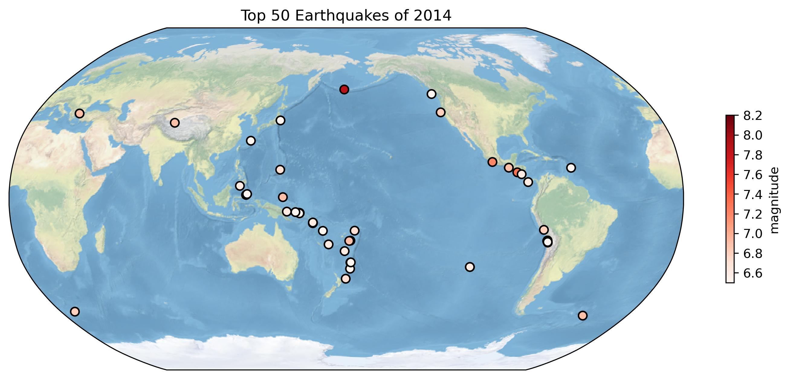
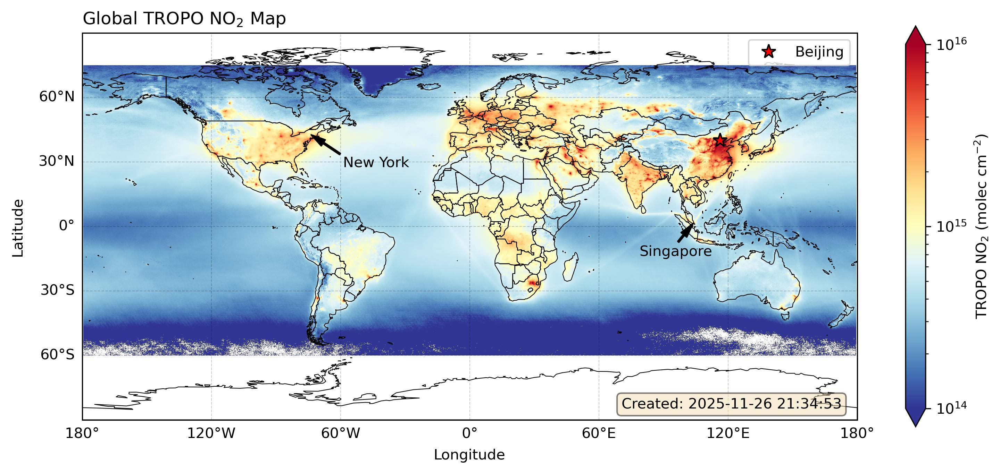
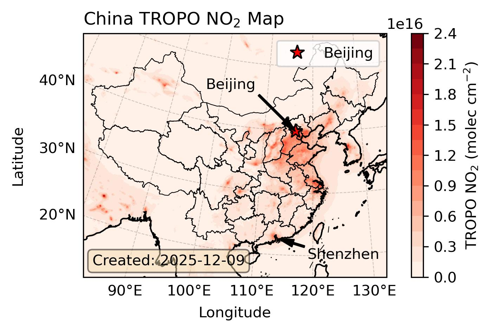

# Assignment 04

环境准备：

```python
import numpy as np
import xarray as xr
import pandas as pd
import matplotlib.pyplot as plt
import matplotlib as mpl
import cartopy.crs as ccrs
import cartopy.feature as cfeature
import geopandas as gpd
```

## 1. Global Earthquakes

In this problem set, we will use [this file](https://zhu-group.github.io/ese5023/download/usgs_earthquakes.csv) from the USGS Earthquakes Database. The dataset is similar to the one you use in [Assignment 02](https://zhu-group.github.io/ese5023/Assignment_02.html#1_Significant_earthquakes_since_2150_BC). Use the file provided (usgs_earthquakes.csv) to recreate the following map. Use the mag column for magnitude. [10 points]


读取相关数据库，根据时间筛选地震数据，并提取震级排名前 50 的经纬度和震级数据。依照参考图设置图像尺寸、投影信息、绘图类型、颜色主题、线条粗细、标记大小、底图填充、标题及色标等。

```python
df = pd.read_csv("./data/usgs_earthquakes.csv", parse_dates=["time"])
df = df.loc[pd.DatetimeIndex(df["time"]).year==2014]
df = df.sort_values(by="mag", ascending=False).iloc[0:50]

fig = plt.figure(figsize=np.array([8, 4])*1.5, dpi=100)
spec = fig.add_gridspec(ncols=1, nrows=1)
ax = fig.add_subplot(spec[0], projection=ccrs.Robinson(central_longitude=-180))
ax.set_extent([0.1, 359.9, -90, 90])
ar = ax.scatter(df["longitude"], df["latitude"], s=45, lw=1.2, c=df["mag"], cmap="Reds", ec="k", transform=ccrs.PlateCarree())
ax.stock_img()
ax.set_title("Top 50 Earthquakes of 2014")
fig.colorbar(ar, ax=ax, label="magnitude", ticks=np.arange(6.6, 8.3, 0.2), shrink=0.4)
fig.savefig("./images/PS4_1_figure1.jpg", bbox_inches="tight", dpi=300)
```

最终得到绘图结果如下：



题目版本：


<div style="page-break-after:always"></div>

## 2. Explore a netCDF dataset

Browse the NASA’s Goddard Earth Sciences Data and Information Services Center (GES DISC) [website](https://disc.gsfc.nasa.gov/). Search and download a dataset you are interested in. You are also welcome to use data from your group in this problem set. But the dataset should be in netCDF format. For this problem set, you are welcome to use the same dataset you used in [Assignment 03](https://zhu-group.github.io/ese5023/Assignment_03.html#3_Explore_a_netCDF_dataset).

这里选择数据为 [TROPOMI 的月均全球 0.1° NO2 观测数据](https://disc.gsfc.nasa.gov/datasets/HAQ_TROPOMI_NO2_GLOBAL_M_L3_2.4/summary)（上一次作业所使用的数据）。考虑到数据量相对单个仓库较为庞大（>2GB），这里仅保留最终用于绘图的数据：

- 所有时段的平均值：HAQ_TROPOMI_NO2_GLOBAL_QA75_L3_Monthly_Mean_V2.4_201901_to_202508.nc

下列代码读取用于绘图的基本数据、feature 等信息：

```python
# data for Figure
ds = xr.open_dataset("./data/HAQ_TROPOMI_NO2_GLOBAL_QA75_L3_Monthly_Mean_V2.4_201901_to_202508.nc")
ds_select_china = ds.sel(lon=slice(65, 140), lat=slice(10, 60))

# cartopy feature
gdf_world = gpd.read_file("./data/world.zh.json")
gdf_china = gpd.read_file("./data/china_province.geojson").sort_values(by="gb")
geojson_world = gdf_world["geometry"]
geojson_china = gdf_china["geometry"]
gdf_china = gdf_china.loc[gdf_china["name"]!="境界线"]
gdf_china.reset_index(inplace=True)
shp_world = cfeature.ShapelyFeature(geojson_world, ccrs.PlateCarree(), fc="none", ec="k", lw=0.5)
shp_china = cfeature.ShapelyFeature(geojson_china, ccrs.PlateCarree(), fc="none", ec="k", lw=0.5)
```

### 2.1 [10 points]

Make a global map of a certain variable. Your figure should contain: a project, x label and ticks, y label and ticks, title, gridlines, legend, colorbar, masks or features, annotations, and text box (1 point each).

依照题目要求，绘制了全球对流层 NO2 均值如下，并增加相关标记，使用经纬度投影绘制。

```python
import matplotlib.lines as mlines
blue_line = mlines.Line2D([], [], color='blue', marker='*',
                          markersize=15, label='Blue stars')

fig = plt.figure(figsize=[12, 5], dpi=100)
spec = fig.add_gridspec(ncols=1, nrows=1)

# PlateCarree Project
ax = fig.add_subplot(spec[0], projection=ccrs.PlateCarree())
ax.set_extent([-180, 180, -90, 90])
# Map
ar = ax.pcolormesh(ds["lon"], ds["lat"], ds["Tropospheric_NO2"], norm=mpl.colors.LogNorm(vmin=1e14, vmax=1e16), cmap="RdYlBu_r", transform=ccrs.PlateCarree())
# X-label, Y-label
ax.set_xlabel('Longitude', labelpad=20)
ax.set_ylabel('Latitude', labelpad=40)
ax.set(xticks=[], yticks=[])
# Title
ax.set_title(r"Global TROPO NO$_2$ Map", loc="left")
# Gridlines, X-ticks, Y-ticks
gl = ax.gridlines(color="k", linestyle="--", lw=0.5, draw_labels=True, x_inline=False, y_inline=False, dms=True, alpha=0.2)
gl.top_labels, gl.right_labels, gl.rotate_labels = False, False, False
# Legend
ax.plot([116.40753], [39.90403], "r*", mec="k", ms=10, label="Beijing", transform=ccrs.PlateCarree())
ax.legend(loc='upper right', bbox_to_anchor=(1, 1))
# Colorbar
fig.colorbar(ar, ax=ax, extend="both", label=r"TROPO NO$_2$ (molec cm$^{-2}$)")
# Masks or Features
ax.add_feature(shp_world)
# Annotations
ax.annotate("New York", xy=(-73.754968, 42.6511674), xytext=(-73.754968+15, 42.6511674-15), arrowprops=dict(facecolor='black', shrink=0.01, width=1, headwidth=5, headlength=10), transform=ccrs.PlateCarree())
ax.annotate("Singapore", xy=(103.822872, 1.364917), xytext=(103.822872-25, 1.364917-15), arrowprops=dict(facecolor='black', shrink=0.01, width=1, headwidth=5, headlength=10), transform=ccrs.PlateCarree())
# Text Box
ax.text(0.98, 0.03, "Created: 2025-11-26 21:34:53", transform=ax.transAxes, horizontalalignment="right", bbox=dict(boxstyle='round', facecolor='wheat', alpha=0.5))
fig.savefig("./images/PS4_2_figure1.jpg", bbox_inches="tight", dpi=300)
```



### 2.2 [10 points]

Make a regional map of the same variable. Your figure should contain: a different project, x label and ticks, y label and ticks, title, gridlines, legend, colorbar, masks or features, annotations, and text box (1 point each).

依照题目要求，绘制了中国大陆及周边对流层 NO2 均值如下，并增加相关标记，使用兰伯特投影绘制。

```python
fig = plt.figure(figsize=[6, 3], dpi=100)
spec = fig.add_gridspec(ncols=1, nrows=1)
# Lambert Project
ax = fig.add_subplot(spec[0], projection=ccrs.LambertConformal(central_longitude=120, central_latitude=34, standard_parallels=[20, 40]))
ax.set_extent([82, 132, 16, 51])
# Map
ar = ax.contourf(ds_select_china["lon"], ds_select_china["lat"], ds_select_china["Tropospheric_NO2"], levels=20, cmap="Reds", transform=ccrs.PlateCarree())
# X-label, Y-label
ax.set_xlabel('Longitude', labelpad=20)
ax.set_ylabel('Latitude', labelpad=40)
ax.set(xticks=[], yticks=[])
# Title
ax.set_title(r"China TROPO NO$_2$ Map", loc="left")
# Gridlines, X-ticks and Y-ticks
gl = ax.gridlines(color="k", linestyle="--", lw=0.5, draw_labels=["bottom", "left"], x_inline=False, y_inline=False, dms=True, alpha=0.2, rotate_labels=False)
# Legend
ax.plot([116.40753], [39.90403], "r*", mec="k", ms=10, label="Beijing", transform=ccrs.PlateCarree())
ax.legend(loc='upper right', bbox_to_anchor=(1, 1))
# Colorbar
fig.colorbar(ar, ax=ax, extend="both", label=r"TROPO NO$_2$ (molec cm$^{-2}$)")
# Masks or Features
ax.add_feature(shp_china)
ax.coastlines()
# Annotates
ax.annotate("Beijing", xy=(116.4, 39.9), xytext=(116.4-20, 39.9+5), arrowprops=dict(facecolor='black', shrink=0.01, width=1, headwidth=5, headlength=10), transform=ccrs.PlateCarree())
ax.annotate("Shenzhen", xy=(114.085947, 22.547), xytext=(114.085947+5, 22.547-3), arrowprops=dict(facecolor='black', shrink=0.01, width=1, headwidth=5, headlength=10), transform=ccrs.PlateCarree())
# Text Box
ax.text(0.03, 0.05, "Created: 2025-12-09", transform=ax.transAxes, horizontalalignment="left", bbox=dict(boxstyle='round', facecolor='wheat', alpha=0.5))
fig.savefig("./images/PS4_2_figure2.jpg", bbox_inches="tight", dpi=300)
```

